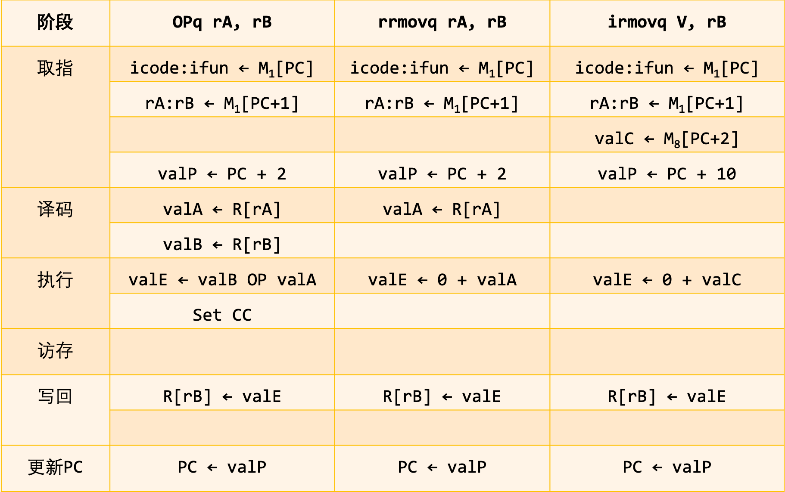
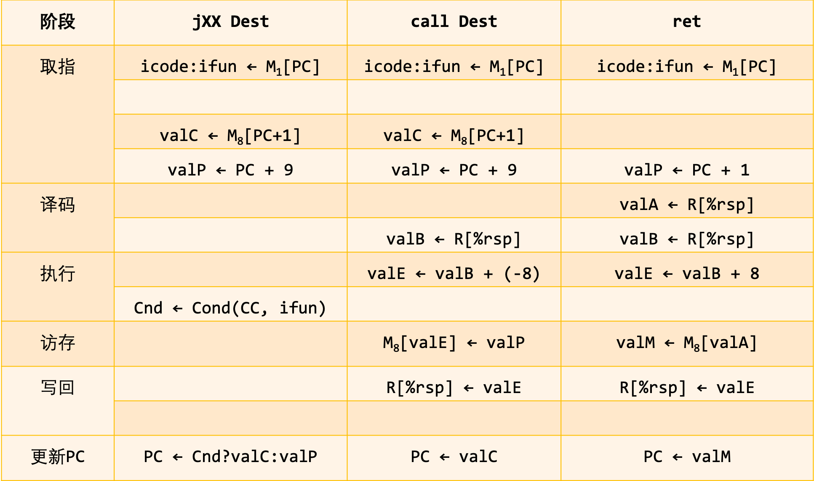

# 处理器体系结构

> 专注于梳理本章中出现的重要概念，对概念的描述尽量做到述而不作，避免因为个人理解偏差对其他人造成误导。
>
> 本章将简要介绍处理器硬件的设计，研究一个硬件系统执行某种ISA指令的方法。

* 指令集体系结构（Instruction Set Architecture，ISA）

  * 描述一个处理器**支持的指令**和**指令的字节级编码**。
  * 为编译器编写者和处理器设计者提供概念抽象层。（相当于一层封装解耦）
  * 不同处理器家族有不同的指令集体系结构，如`x86-64`、`ARM`。

* Y86-64指令集

  受x86-64指令集的启发，创建该简化指令集。与x86-64指令集相比；

  * 数据类型、指令和寻址方式比较少
  * 字节级编码比较简单
  * 机器代码相对不那么紧凑，CPU译码逻辑也相对简单
  * 但结构完整，可以写一些处理整数的程序

* 硬件控制语言（HCL）

  描述硬件系统控制部分的简单语言。

## Y86-64指令集体系结构

> 定义Y86-64指令集体系结构中的各种状态单元、指令集和它们的编码、一组编程规范和异常事件处理。

* 程序员可见状态

  程序中的每条指令都会读取或修改处理器状态的某些部分。Y86-64的程序员可见状态包括：

  * 15个程序寄存器，每个程序寄存器存储一个64位的字。存储在CPU中的一个寄存器文件中。

  * 程序寄存器的指示符字节编码如下表所示

    | 程序寄存器   | ID   |
    | :----------- | :--- |
    | %rax         | 0    |
    | %rcx         | 1    |
    | %rdx         | 2    |
    | %rbx         | 3    |
    | %rsp         | 4    |
    | %rbp         | 5    |
    | %rsi         | 6    |
    | %rdi         | 7    |
    | %r8          | 8    |
    | %r9          | 9    |
    | %r10         | A    |
    | %r11         | B    |
    | %r12         | C    |
    | %r13         | D    |
    | %r14         | E    |
    | 无寄存器访问 | F    |

  * 程序计数器（PC）

  * 条件码寄存器：包括3个一位的条件码，ZF、SF和OF。保存最近的算术或逻辑指令所造成影响的有关信息。

  * 内存，用虚拟地址指明数据实际在内存中的存储位置。

  * 状态码（Stat）：程序执行的整体状态。

* Y86-64指令

  * 将MOV指令根据目的和源的格式，分为4种，不支持内存间和立即数到内存的传送。
  * 整数操作指令，分为4种
  * 根据分支指令的类型和条件代码的设置来选择分支，跳转指令分为7种。目的地址采用绝对编码方式（相比于IA32的相对寻址方式）
  * 条件传送指令，分为6种，只有条件码满足所需要的约束时，才会更新目的寄存器的值
  * 函数的调用和返回指令，调用指令的目的地址采用绝对编码方式（相比于IA32的相对寻址方式）
  * 与栈操作相关的入栈和出栈指令
  * 停止指令的执行的指令
  * 空指令

  

* Y86-64指令编码由1~10个字节组成。

  * 第一个字节：指令的类型
    * 高4位代表代码
    * 低4位代表功能，区分共用代码的相关指令
  * 第二个字节：寄存器指示符字节，具体和程序寄存器表中的字节表示对应。
  * 后四个字节：常数字，代表操作数或绝对地址。
  * 指令中的所有整数采用小端法编码，即当按照反汇编格式书写，字节以相反的顺序出现。
  * 字节编码和指令必须一一对应。
  
* CISC和早期的RISC

  | CISC                                                         | 早期的RISC                                                   |
  | ------------------------------------------------------------ | ------------------------------------------------------------ |
  | 指令数量很多                                                 | 指令数量少很多，通常少于100个。                              |
  | 有些指令的延迟很长，如将一整块从内存的一部分复制到另一部分   | 没有较长延迟的指令，有些早期的RISC机器甚至没有整数乘法指令。 |
  | 编码是可变长度的，x86-64的指令长度通常是1~15个字节           | 编码是固定长度的，通常所有指令都编码为4个字节                |
  | 指定操作数的方法有很多                                       | 简单寻址方式，通常只有基址和偏移量寻址                       |
  | 可以对内存和寄存器操作数进行算术和逻辑运算                   | 只能对寄存器操作进行算术逻辑运算，允许使用内存的只有load和store指令，这种方法称为load/store体系 |
  | 对机器级程序来说，实现细节是不可见的，ISA提供程序和如何执行程序之间的清晰的抽象。 | 对机器级程序来说实现细节是可见的                             |
  | 有条件码，作为指令执行的副产品，设置了一些特殊的标志位，可以用于条件分支检测。 | 没有条件码，对条件检测来说，要明确测试指令，将测试结果放在一个普通寄存器中。 |
  | 栈密集的过程链接，栈被用来存取过程参数和返回地址             | 寄存器密集的过程链接，因此有些过程能完全避免内存引用。       |

  Y86-64指令集可以看成是采用CISC指令集，但又根据某些RISC的原理进行了简化。

* Y86-64指令集状态码（Stat）可能的值

  | 状态码值 | 名字 | 含义                            |
  | -------- | ---- | ------------------------------- |
  | 1        | AOK  | 正常操作                        |
  | 2        | HLT  | 处理器执行halt指令              |
  | 3        | ADR  | 处理器遇到非法内存地址（读/写） |
  | 4        | INS  | 处理器遇到非法指令代码          |

  除AOK外，状态码等于其他值都意味着，硬件在执行指令时遇到异常，有两种解决方法：

  * 简单粗暴的让处理器停止程序的运行。（Y86-64采用这种方法）
  * 让处理器调用异常处理程序，根据配置的不同结果，中止程序或者调用一个用户自定义的信号处理程序。

* 一个基于Y86-64指令集运行程序的全过程

  * 使用Y86-64定义的指令规则编写对应的汇编代码。其中包含指令、伪指令（指明应该将代码或数据放在什么位置以及如何对齐）、数据。
  * 将汇编代码输入YAS汇编器，输出目标代码。目标代码包含一个地址，后面跟着1~10个字节的值。
  * 通过指令模拟器YIS，模拟Y86-64机器代码程序的执行，而不用去模拟任何具体处理器实现的行为，有助于在有实际硬件可用之前调试程序。

* 两个会对设计产生歧义的指令

  * `pushq %rsp`

    压入的是%rsp寄存器的原始值

  * `popq %rsp`

    将%rsp设置为从内存中读出的值

## 逻辑设计和硬件控制语言HCL

> 在底层硬件实现中，用电子电路来对应进行运算函数，以及在各种存储器单元中存储位。所以设计一个数字系统需要考虑以下三个组成部分的逻辑设计：
>
> * 计算对位进行操作的函数的组合逻辑
> * 存储位的存储器单元
> * 控制存储器单元进行更新的时钟信号
>
> 同时为了方便电路的设计工作，推出硬件控制语言（HCL）来抽象描述不同处理器设计的控制逻辑。

* 数字电路的基本计算单元——逻辑门

  * 逻辑门的输出等于输入位值的某个布尔函数，只对单个位的数进行操作
  * HCL写法为：`&&`、`||`、`!`（与、或、非）
  * 逻辑门总是活动的，一旦一个门的输入发生变化，在短时间内，输出也会发生变化。

* 组合电路

  将很多的逻辑门组合成一个网，就能构建计算块，这个计算块被称为组合电路。组合电路的构建有以下三个限制：

  * 这个网必须是无环的。
  * 两个或多个逻辑门的输出不能连接到一起。
  * 每个逻辑门的输入必须连到，一个系统输入、某个存储器单元的输出或者某个逻辑门的输出。

* 多路复用器（multiplexor）

  根据输入的控制信号的值，从一组不同的数据信号中选出一个。下图所示是一个但各位的多路复用器的电路

  

* 字级的组合电路

  根据输入字的各个位，用逻辑门来计算输出字的各个位。

* 多路复用器的HCL描述——情况表达式

  ```
  [
  	select1 : expr1
  	select2 : expr2
  	...
  	selectk : exprk
  ]
  ```

  每种情况都包含一个布尔表达式和一个整数表达式，前者表示什么时候选择这个情况，后者表示得到的值。布尔表达式顺序求值，第一个求值为1的情况被选中。

* 算术/逻辑单元（ALU）

  在字级数据上执行许多不同类型的操作的组合逻辑电路，ALU有两个数据输入和一个控制输入，根据控制输入的设置，电路会对数据输入执行不同的算术逻辑运算，Y86-64指令集支持的四种不同的整数运算的ALU抽象表示如下图所示：

  

* 集合关系的HCL描述

  * 应用场景：在处理器的设计中，很多时候都需要将一个信号与许多可能匹配的信号做比较，以此来检测正在处理的某个指令代码是否属于某一类指令代码。

  * 通用格式为

    ```
    iexpr in {iexpr1, iexpr2, ..., iexprk
    ```

    其中iexpr为整数表达式。

* 时序电路

  电路中存有状态，并且在这个状态上进行计算的系统。需要引入按位存储信息的设备，存储设备都是由同一个时钟控制的，时钟是一个周期性信号，决定什么时候把新值加载到设备中，以下是两类存储器设备：

  * 时钟寄存器存储单个位或字。时钟信号控制寄存器加载输入值
  * 随机访问存储器存储多个字
    * 虚拟内存（数据内存和指令内存）
    * 寄存器文件

* 硬件寄存器和程序寄存器

  * 硬件寄存器：直接将寄存器的输入输出线连接到电路的其他部分。大多数时候，寄存器都保持在一个稳定的状态，产生的输出值等于它的当前状态。只有当时钟变成高电位的时候，新的输入信号才会加载到寄存器中，成为该寄存器下一个稳定的状态。

    

  * 程序寄存器：CPU中为数不多的可寻址的字

* 寄存器文件

  

  * 两个读端口A和B，当srcA或srcB被设置为某个寄存器ID时，在一段延迟后，存储在相应程序寄存器的值就会出现在valA或valB上。
  * 一个写端口W，向寄存器文件写入字是由时钟信号控制的，控制方法类似于将值加载到时钟寄存器。当dstW设置为特殊的ID值0xF时，不会写任何程序寄存器。

* 随机访问存储器

  

  * 一个地址输入，一个写的数据输入，以及一个读的数据输出
  * write控制信号为0，读输入地址上的数据，如果地址超出了范围，error信号会设置为1，否则为0。
  * write控制信号为1，写输入地址上的数据，如果地址超出了范围，error信号会设置为1，否则为0。
  * error信号是由组合逻辑产生的，因为边界检查并不涉及保存状态。

## Y86-64的顺序实现

> 在上一节引入算术/逻辑单元（ALU）、时钟寄存器、随机访问存储器的基础上，描述如何实现一个SEQ（顺序的）处理器。
>
> SEQ处理器的典型特点是：在每个时钟周期上，SEQ执行处理一条完整指令所需的所有步骤。

* 将指令操作分为相同阶段的通用框架

  * 原理：给每个指令对应一套硬件逻辑实现是不靠谱的，在设计硬件时，有一个非常简单且一致的结构非常重要，希望硬件数量尽可能的少，并最终将它映射到一个二维集成电路芯片的表面。

  * 降低硬件复杂度的方法：让不同指令共享尽量多的硬件。
  * 六层通用处理框架
    * 取值：取指阶段从内存中读取指令字节，读取地址为当前PC的值。
      * 得到指令指示符字节，包括指令代码（icode）和指令功能（ifun）两个部分。
      * 得到寄存器指示符字节，包括可能参与后续操作的一个或两个寄存器，rA和rB。
      * 得到八个字节常数字valC。
      * 计算当前指令的下一条指令的地址valP，等于PC的值加上已取出指令的长度。
    * 译码：从寄存器文件读入最多两个操作数。
      * 读rA或/和rB寄存器得到valA或/和valB。
      * 如果需要读寄存器%rsp。
    * 执行：算术/逻辑单元（ALU）根据取值阶段得到的ifun，执行指令指明的操作，计算内存引用的有效地址；或增加或减少栈指针，得到valE。
      * 可能设置条件码，比如条件传送指令中，根据传送条件ifun和传送值设置条件码。
    * 访存：将数据写入内存或从内存中读出数据，读出的值为valM。
    * 写回：最多可以写两个结果到寄存器文件。
    * 更新PC：将PC设置为下一条指令的地址。

* 不同的Y86-64指令在各个阶段的处理过程。

  * 整数和逻辑运算（OPq）、rrmovq（寄存器-寄存器传送）和irmovq（立即数-寄存器传送）

    

  * rmmovq（寄存器-内存传送）、mrmovq（内存-寄存器传送）、cmovXX（各种条件传送）

    

  * pushq（入栈）、popq（出栈）

    * 在pushq指令的阶段编写中，为了和之前确认的规则一致，即歧义指令`pushq %rsp`的执行应该将寄存器%rsp的原始值压入栈，故在访存阶段，将valA写回内存中。
    * 在popq指令的阶段编写中，为了和之前确认的规则一致，即歧义指令`popq %rsp`的执行应该将寄存器%rsp的值设置为从内存中读出的值，故在写回阶段，先写回valE再写回valM。

    

  * jXX（各种跳转）、call（调用）、ret（返回）

    * 跳转指令需要在执行阶段，检查条件码和跳转条件，产生一个一位信号Cnd，在更新PC阶段，根据产生的Cnd信号决定下一条将要执行的地址。
    * 调用指令（call）需要将call指令后紧跟的那条指令的地址压入栈， 在更新PC时，将PC设置为调用的目的地（valC）。
    * 返回指令（ret）在更新阶段需要将从栈里取出的值，赋值给PC。

    

* SEQ处理器硬件结构的抽象表示

  * Y86-64所有指令的计算被组织为6个基本阶段：取指、译码、执行、访存、写回、更新PC。
  * 每个阶段有相对应的硬件负责处理本阶段的工作。
  * 信息沿着线流动，先向上，再向右。
  * 反馈线路向下，包括要写到寄存器文件的更新值，以及更新的程序计数器值。
  * 从下往上画处理器和流程的方法，有利于后面设计流水线化的处理器。

  

* 一个较为详细的SEQ处理器硬件结构的表示

  * 白色方框表示时钟寄存器（由时钟信号控制寄存器加载输入值），图中唯一的时钟寄存器是PC。
  * 浅蓝色方框表示硬件单元，如ALU等，在这里把它们当做黑盒，不关注其内部具体的实现细节。
  * 灰色圆角矩形表示控制逻辑块，用于从一组信号源中进行选择，或者用来计算一些布尔函数。
  * 白色圆圈表示线路的名字。
  * 中等粗度的线表示宽度为字长的数据连接，表示将一个字从硬件的一部分传送到另一部分。
  * 细线表示宽度为字节或更窄的数据连接。根据具体的数据类型，选择传递的字节数。
  * 虚线表示单个位的连接。代表芯片上单元与块之间传递的控制值。

  

* 硬件设计和指令阶段之间的映射

  * 在硬件的设计工作中，要将计算映射到硬件上，需要实现控制逻辑，它能在不同硬件单元之间传送数据，以及操作这些单元，使得对每个不同的指令执行指定的运算。
  * 可以说，在这里硬件设计的重中之重是控制逻辑的设计。
  * 除了之前介绍的操作存储设备和算术/逻辑单元的信号外，新引入四个寄存器ID信号：srcA、valA的源；srcB、valB的源；dstE，写入valE的寄存器；以及dstM，写入valM的寄存器。

* SEQ的时序控制

  * 目的：由于一个时钟变化会引发一个经过组合逻辑的流，来执行整个指令，而像之前说的存在一些硬件单元（如时钟寄存器、寄存器文件等），它们所执行的操作是和时钟密切相关的，所以需要对它们的时序进行明确说明。
  * 指令内存可以看出和组合逻辑一样的操作。（因为只读，不考虑时序变化对它的影响）
  * 程序寄存器、条件码寄存器、数据内存和寄存器文件的时序需要进行明确的控制，使得它们也可以像组合逻辑电路一样，输入一个地址产生输出的字。
  * 遵循从不回读原则
    * 目的：保证即使所有的寄存器状态更新实际上同时发生，指令内的赋值顺序并不会因此而发生改变。
    * 处理器从来不需要为了完成一条指令的执行而去读由该指令更新了的状态。
  * 每个周期开始时，状态单元（程序计数器、条件码寄存器、寄存器文件以及数据内存）是根据前一条指令设置的。信号传播通过组合逻辑，创建出新的状态单元的值。在下一个周期开始时，这些值会被加载到状态单元里。状态单元的写操作只在时钟的上升阶段执行。

* 