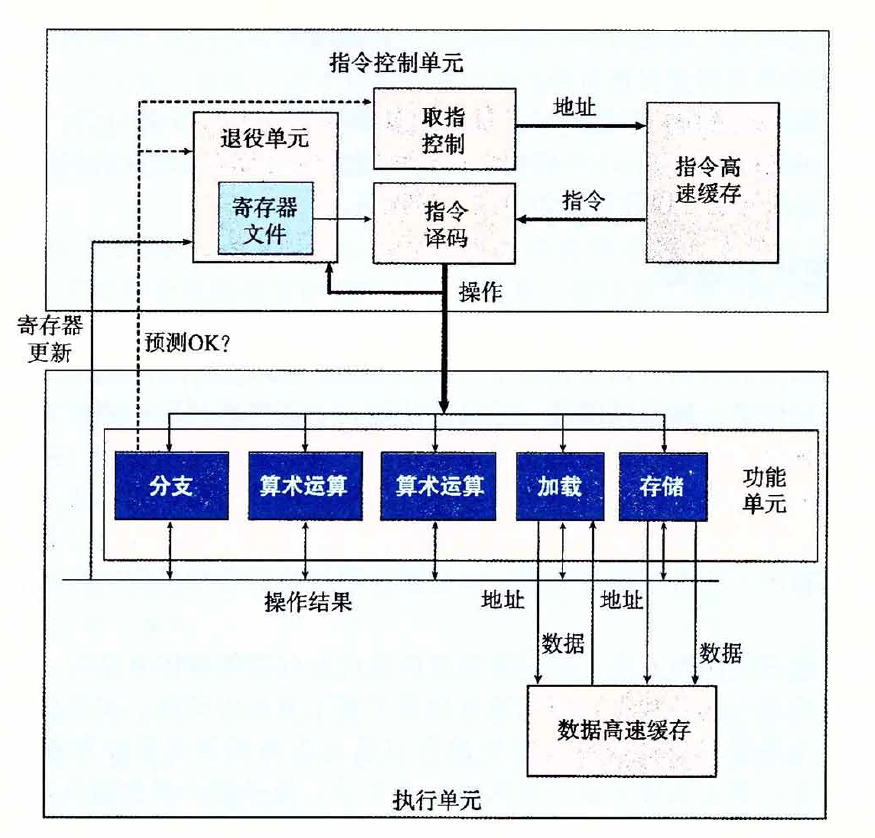
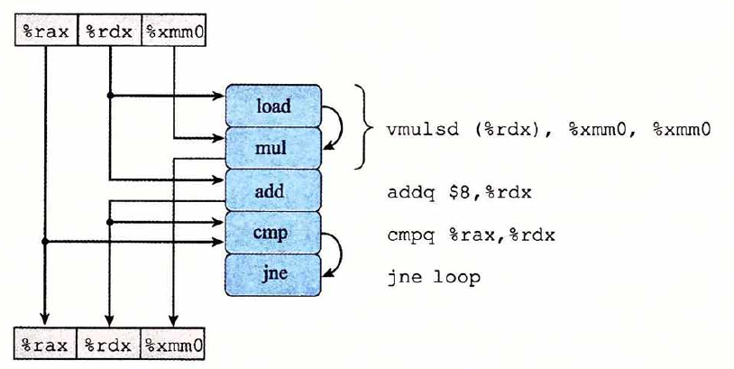
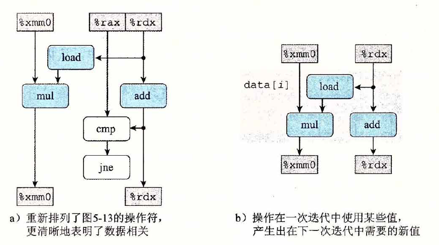
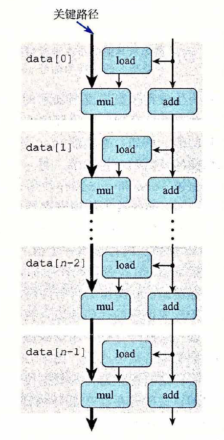
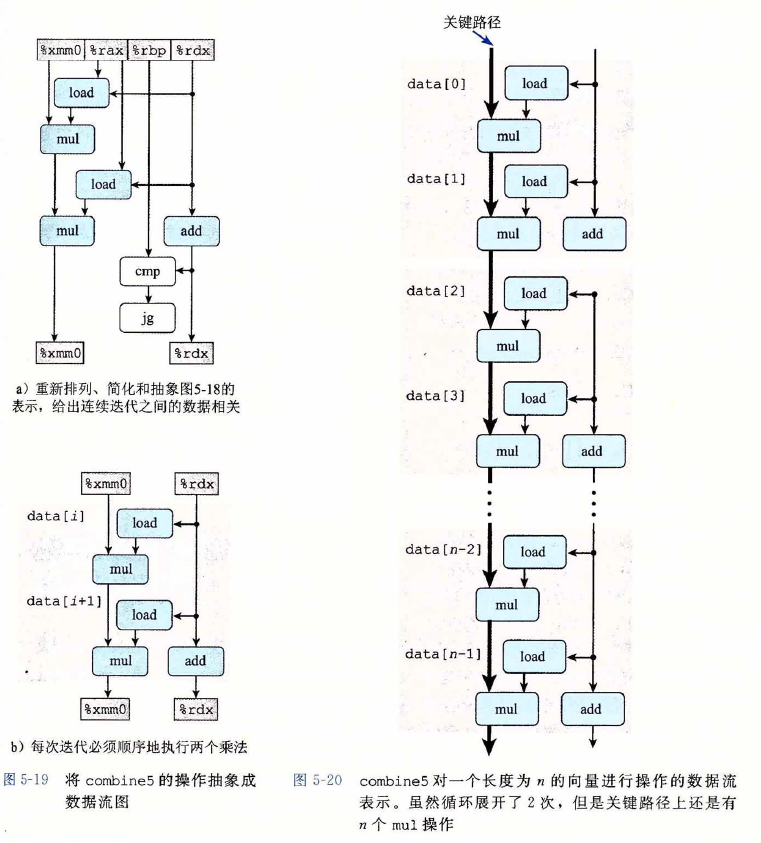

# 优化程序性能

> 专注于梳理本章中出现的重要概念，对概念的描述尽量做到述而不作，避免因为个人理解偏差对其他人造成误导。
>
> 本章主要介绍如何使用几种不同类型的程序优化技术，在程序运行正确的基础上，使程序运行的更快。

* 编写高效程序的方法论

  * 选择一组适当的数据结构和算法
  * 必须编写出编译器能够有效优化以转换成高效可执行代码的源代码，理解编译器的能力和局限性很重要（比如C语言中执行指针运算和强制类型转换就很难被编译器优化）
  * 针对处理运算量特别大的计算，将一个任务分成多个部分，这些部分可以在多核和多处理器的某种组合上并行的计算

* 妨碍优化的因素（optimization blocker）

  程序行为中那些严重依赖于执行环境的方面，比如可能出现的内存别名使用、函数调用等。

* 汇编代码 VS 重写程序

  使用汇编代码，固然也可以达到优化程序性能的目的，但是汇编代码具有比较强的平台依赖性，不容易移植。相比于另一种方法，不断重写程序直到编译器由此可以产生有效的代码为止，虽然性能不一定是最好的，但是得到的代码可以在其他机器上运行。

* 现实中，对代码的优化不是一帆风顺的

  优化需要很多的试错实验，一些看上去很小的变化会导致性能上很大的变化，而性能可能依赖于处理器设计的许多细节特性，对此我们所知甚少，所以要想让编译器尽可能的产生有效代码，需要

  * 尝试各种技术的变形和组合
  * 理解编译器产生的汇编代码，在此基础上，修改源代码
  * 循环修改代码，分析性能，使编译产生的代码尽可能的好


## 优化编译器的能力和局限性

* 编译器提供的优化控制

  现代编译器运用复杂精细的算法来确定一个程序中计算的是什么值，以及它们是如何被使用的，然后会利用一些机会来简化表达式。

  大多数编译器，向用户提供了一些对它们所使用的优化的控制，最简单的优化控制优化级别，比如`-Og`、`-O1`、`-O2`等。

* 安全的优化

  对于程序可能遇到的所有可能的情况，保证优化后得到的程序和未优化的版本有一样的行为。

  编译器只对程序进行安全的优化，在优化过程中，考虑妨碍优化的因素。

  * 内存别名使用

    程序中的两个指针可能指向同一个内存位置。如果编译器不能确定两个指针是否指向了同一个位置，就必须假设什么情况都有可能，这就限制了可能的优化策略。

  * 函数调用

    函数的执行过程中可能会修改全局程序状态的一部分，改变调用函数的次数会改变程序的行为，所以大多数编译器不会试图判断一个函数是否没有副作用，而会直接假设是最糟的情况，并保持所有函数的调用不变。

* 用**内联函数替换**（inline substitution）优化函数调用

  直接将函数调用替换成函数体本身。这样转换既减少了函数调用的开销，也允许对展开代码做进一步的优化。

  在GCC中，可以使用命令行选项`-finline`指示，或者使用优化等级`-O1`及以上，但是GCC只尝试在单个文件中定义的函数的内联，也就是说它无法处理一组库函数在一个文件中被定义，却被其他文件内的函数所调用。

  不过使用内联函数替换会影响符号调试器追踪或者设置断点。

## 表示程序性能

* 时钟频率/时钟周期

  通常用千兆赫兹（GHz）来表示，即十亿周期每秒，比如一个系统有”4GHz“处理器，这表示处理器时钟运行频率为每秒$4\times 10^9$个周期，每个周期的时间是时钟频率的倒数。

* 每元素的周期数（Cycles Per Element, CPE）

  以”前缀和“为例，随着运算的数据规模的增加，一个过程所需要的时间（以时钟周期为单位）可以用一个常数加上一个与被处理元素个数成正比的因子来描述，这个系数就是CPE的有效值。

## 程序示例

* C语言里面的宏定义`#define`真的很强啊，以前都不知道还可以直接定义操作的，例如

  ```c
  #define OP +
  int main() {
    int a = 1;
    int b = 2;
    int c = a OP b;
    printf("%d\n", c);
  }
  ```

* 养成使用编译器的级别优化是一个好习惯

  未经优化的代码是从C语言到机器代码的直接翻译，通常效率明显比较低，简单的使用命令行选项`-O1`，就会进行一些基本的优化，程序员不需要做什么，就可以达到一定的优化效果。
  
* 一个优化示例

  使用某种运算，将一个向量中所有的元素合并成一个值。通过使用编译时常数IDENT和OP的不同定义，该代码可以重新编译成对数据执行不同的运算。下面是`combine1`的代码，书中后面提到的优化方案都是基于这个代码做实验的。

  ```c
  #define OP +
  #define IDENT 0
  void combine1(vec_ptr v, data_t *dest) {
  	 long i;
  	 *dest = IDENT;
  	 for (i = 0;i < vec_length(v);i++) {
  	 	data_t val;
  	 	get_vec_element(v, i, &val);
  	 	*dest = *dest OP val;
  	 }
  }
  ```

## 消除循环的低效率

* 代码移动（code motion）

  比较常见的优化方法，这类优化包括识别要执行多次（例如在循环里）但是计算结果不会改变的计算，将计算移动到代码前面不会被多次求值的部分。

  优化编译器虽然会试着进行代码移动，但是对于会改变在哪里调用函数或调用多少次的变换，编译器通常会非常小心。它们不能可靠地发现一个函数是否会有副作用，因而假设函数会有副作用。

  ```c
  /* 把调用vec_length函数移动到循环外 */
  void combine2(vec_ptr v, data_t *dest) {
    long i;
    long length = vec_length(v);
    
    *dest = IDENT;
    for (i = 0; i < length;i++) {
      data_t val;
  	 	get_vec_element(v, i, &val);
  	 	*dest = *dest OP val;
    }
  }
  ```

* 库函数strlen的实现

  虽然strlen通常是用特殊的x86字符串处理指令来实现的，但是它的整体执行还是需要一步一步检查整个序列，直到碰到结尾的null为止。如果在一个循环体中以调用`strlen()`函数作为判断停止的条件，那么会使得整体运行时间变成字符串长度的二次项。

## 减少过程调用

* 以从数组中读取指定下标的元素为例

  如果通过调用一个函数来获取指定元素，那每次都需要把索引和循环边界做比较。如果按顺序访问数组中的元素，且明确不会越界，那么每次做判断会导致低效率。（但是因为其他一些限制因素，这样修改后没有带来太大的性能提升）

  ```c
  data_t *get_vec_start(vec_ptr v) {
    return v->data;
  }
  
  /* 直接访问数组元素 */
  void combine3(vec_ptr v, data_t *dest) {
    long i;
    long length = vec_length(v);
    data_t *data = get_vec_start(v);
    
    *dest = IDENT;
    for (i = 0; i < length;i++) {
  	 	*dest = *dest OP data[i];
    }
  }
  ```

## 消除不必要的内存引用

* 在累积求值时，不需要每次都把中间结果写到内存中，读/写内存的开销是很大的。

  ```c
  /* 在局部变量中进行结果的累加 */
  void combine4(vec_ptr v, data_t *dest) {
    long i;
    long length = vec_length(v);
    data_t *data = get_vec_start(v);
    data_t acc = IDENT;
    
    for (i = 0; i < length;i++) {
  	 	acc = acc OP data[i];
    }
    *dest = acc;
  }
  ```

  给编译器加优化编译参数，并不会对`combine3`中的内存访问进行自动优化，因为可能存在之前所说的内存别名问题，比如若定义`dest=get_vec_start(v) + 2`，调用`combine3`和`combine4`会产生不一样的结果。

## 理解现代处理器

> 以上的优化方案不依赖于目标机器的任何特性，这些优化只是简单地降低了过程调用的开销，消除了一些重大的”妨碍优化的因素“，尽可能的帮助编译器，使其能生成高性能代码。

* 指令级并行

  在代码级别看上去是一次执行一条指令，每条指令都包括从寄存器或内存取值，执行一个操作，并把结果存回到一个寄存器或内存位置。在实际的处理器中，是同时对多条指令求值的。现代微处理器保证多条指令可以并行地执行，同时又呈现出一种简单的顺序执行指令的表项。

* 延迟界限和吞吐量界限

  这两种下界描述了程序的最大性能。

  * 当一系列操作必须按照严格顺序执行时，就会遇到延迟界限（latency bound）。下一条指令开始之前，这条指令必须结束，代码中的数据相关限制了处理器利用指令级并行的能力时，延迟界限能够限制程序性能。

    延迟界限给出了任何必须按照严格顺序完成合并运算的函数所需要的最小CPE的值（就是某个的操作的延迟）

  * 吞吐量界限（throughput bound）刻画了处理器功能单元的原始计算能力，这个界限是程序性能的终极限制。

    根据功能单元产生结果的最大速率，吞吐量界限给出了CPE的最小界限，比如四个功能单元都可以执行整数加法，处理器有可能持续每个周期执行4个操作的速率，但是两个加载单元限制了处理器每个时钟周期最多能读取两个数据值，故这种情况下吞吐量界限为0.5。

* 超标量（superscalar）

  一种处理器的设计方式，在每个时钟周期都可以乱序的执行多个操作，指令执行的顺序不一定要与它们在机器级程序中的顺序一致。整个设计有两个主要部分：

  * 指令控制单元（Instruction Control Unit，ICU）

    ICU从指令高速缓存（instruction cache，特殊的高速存储器包含最近访问的指令）中读取指令。通常会在当前执行的指令很早之前就取值，这样才有足够的时间对指令译码。对于存在分支无法判断前进方向的时候，可以采用

    * 使用分支预测（branch prediction）的技术，处理器猜测是否会选择分支，同时还预测分支的目标地址。使用投机执行（speculative prediction）的技术，处理器会取出位于它预测的分支会跳到的地方的指令，并对指令译码，甚至开始提前执行。
    * 采用以上方法，一旦后面发现分支预测错误，会将状态重新设置到分支点的状态，并开始取出和执行相反方向的指令。
    * ICU中的”取值控制“块包括分支预测，负责确定取哪些指令。

    ICU中的”指令译码“逻辑负责接收实际的程序指令，并将它们转换成一组基本操作。一条复杂的指令可以被译码成多个操作，这个不同的机器都不大相同。

    ICU中的“退役单元”记录正在进行的处理，并确保它遵守机器级程序的顺序的语义。如图所示其内部包括一个寄存器文件，它包含整数、浮点数和最近的SSE和AVX寄存器，退役单元会控制这些寄存器的实际更新。指令译码阶段，关于指令的信息被放置在一个先进先出的队列中，这个信息会一直保持在队列中，直到：

    * 一条指令的操作完成了，而且所有引起这条指令的分支点也都被确认为预测正确，那么这条指令就可以退役了，所有对程序寄存器的更新都可以被实际执行了。
    * 如果引起该指令的某个分支点预测错误，这条指令会被清空，丢弃所有计算出来的结果。

  * 执行单元（Execution Unit，EU）

    * EU接收来自取值单元的操作，每个时钟周期会接收多个操作，这些操作会被分派到一组功能单元中，不同的功能单元负责不同类型的操作。

    * 执行过程中读写内存是由加载和存储单元实现的，对地址的计算由加法器完成，通过数据高速缓存（高速存储器，存放最近访问的数据值）来访问内存。

    * 使用投机执行技术对操作数求值的结果不会放在程序寄存器或者数据内存中，直到确定对指令的预测是正确。若预测错误，EU会丢弃分支点之后计算出来的结果，并发信号给分支单元，说明预测错误，并指出正确的分支目的，至此分支单元会反作用于取指控制，重新取指。

    * 随着技术的发展，功能单元的数量，每个单元能执行的操作的组合以及每个单元的性能都有所增加。以Intel Core i7 Haswell参考机有8个功能单元为例，它有4个功能单元可以执行整数操作，2个功能单元可以执行加载操作，2个功能单元可以执行浮点乘法。

      | 编号 |                单元的功能                |
      | :--: | :--------------------------------------: |
      |  0   | 整数运算、浮点乘、整数和浮点数除法、分支 |
      |  1   |     整数运算、浮点加、整数乘、浮点乘     |
      |  2   |              加载、地址计算              |
      |  3   |              加载、地址计算              |
      |  4   |                   存储                   |
      |  5   |                 整数运算                 |
      |  6   |              整数运算、分支              |
      |  7   |              存储、地址计算              |

  * 寄存器重命名

    通用的技术用于控制操作数在执行单元间传送。当一条更新寄存器r的指令译码时，产生标记t，得到一个指向该操作结果的唯一的标识符。条目（r，t）被加入到一个表中。当随后以寄存器r作为操作数的指令译码时，发送到指令单元的操作会包含t作为操作数源的值。当某个执行单元完成第一操作时，会生成一个结果（v，t），指明标记为t的操作产生值v，所有等待t作为源的操作都能使用v作为源值，这就是一种形式的数据转发。（值可以从一个操作直接转发到另一个操作，而不是写到寄存器文件再读出来）

  

  

* 功能单元的性能描述

  * 延迟：完成运算需要的总时间
  * 发射时间：两个连续的同类型的运算之间需要的最小时钟周期数
  * 容量： 能够执行该运算的功能单元的数量

* 完全流水线化

  流水线化的功能单元，实现为一系列的阶段，每个阶段完成一部分的运算，算术运算可以连续地通过各个阶段，而不同等待一个操作完成后再进行下一个，这种发射时间为1的功能单元被称为完全流水线化的。（除法器不是完全流水线化的）

* 最大吞吐量（发射时间的倒数）

  一个完全流水线化的功能单元有最大的吞吐量，每个时钟周期一个运算，发射时间较大的功能单元的最大吞吐量比较小，具有多个功能单元可以进一步提供吞吐量。

  对于一个容量为C，发射时间为I的操作来说，处理器可能获得的吞吐量为每时钟周期$C/I$个操作。

* 程序的数据流

  是一种图形化表示方法，作为分析现代处理器上执行的机器级程序性能的一个工具，展现了不同操作之间的数据相关是如何限制它们的执行顺序的。

* 关键路径

  因为不同的操作之间可能存在数据相关，会限制执行的顺序，故将执行一组机器指令所需时钟周期数的一个下界称为关键路径。

* 以前面`combine4`的代码为例，说明从机器级代码到数据流图

  ```
  combine4的内部循环，data_t=double，OP=*
  acc放在%xmm0，data+i放在%rdx，data+length放在%rax
  .L25
  	vmulsd (%rdx), %xmm0, %xmm0
  	addq $8, %rdx
  	cmpq %rax, %rdx
  	jne .L25
  ```

  * 指令译码器将上面的四条指令扩展成为一系列的五步操作，最开始的乘法指令被扩展成为一个load操作，从内存读出源操作数，和一个mul操作，执行乘法。

  * 生成程序数据流图表示的第一步，给出各个指令是如何使用和更新寄存器的，顶部的方框表示循环开始时寄存器的值，而底部的方框表示最后寄存器的值。某些操作产生的值不对应于任何寄存器，用操作间的弧线表示。

    

  * 对于形成循环的代码片段，可以将访问到的寄存器分为四类

    * 只读：只作为源值，在循环中它们不会被修改
    * 只写：作为数据传送操作的目的
    * 局部：寄存器在循环内部被修改和使用，迭代与迭代之间不相关（比如条件码寄存器）
    * 循环：对于循环来说，这些寄存器既作为源值，又作为目的，一次迭代中产生的值会在另一次迭代中用到。（%xmm0和%rdx）

    循环寄存器之间的操作链决定了限制性能的数据相关。

  * 对以上数据流图进行改进，只给出影响程序执行时间的操作和数据相关。重新排列操作符，如果操作符不属于某个循环寄存器之间的相关链，则标识为白色。最后只保留循环寄存器，得到的是一个抽象的模板，表明的是由于循环一次迭代在循环寄存器中形成的数据相关。

    

  * 最后得到n次迭代的数据流表示，从图中可以看出，程序有两条数据相关链，分别对应add和mul操作，假设浮点数乘法的延迟大于整数的加法，那么左边的链（mul）会成为关键路径。

    

  * 数据流表示中的关键路径提供的只是程序需要周期数的下界，还有一些其他因素会限制性能。

  * `combine4`程序的性能分析，其关键路径长$L \times n$是由于对程序值acc的连续更新造成的，这条路径将CPE限制为最多L，目前该程序的CPE由延迟界限决定。

## 循环展开

* 循环展开

  一种程序变换，通过增加每次迭代计算的元素的数量，减少循环的迭代次数。可以从两个方面改进程序的性能：

  * 减少了不直接有助于程序结果的操作的数量，比如循环索引计算和条件分支
  * 提供了一些方法，可以进一步变化代码，减少整个计算中关键路径上的操作数量

* 在累积求值时，使用$2\times 1$的循环展开

  ```c
  void combine5(vec_ptr v, data_t *dest) {
  	long i;
  	long length = vec_length(v);
  	long limit = length - 1;
  	data_t *data = get_vec_start(v);
  	data_t acc = IDENT;
  	
  	for (i = 0; i < limit; i += 2) {
  		acc = (acc OP data[i]) OP data[i + 1];
  	}
  	
  	/* 处理余下的元素 */
  	for (; i < length; i++) {
  		acc = acc OP data[i];
  	}
  	*dest = acc;
  }
  ```

  可以将这个思想归纳为对一个循环按任意因子k进行展开，由此产生$k \times 1$循环展开，为此，上限设为$n-k+1$，在循环内对元素$i$到$i+k-1$应用合并计算。在第二个循环中处理剩余的元素，这个循环将被执行$k-1$次。

  通过循环展开，减少了循环开销操作，也就是上面所说的其他因素，此时，一个周期的延迟成为限制性能的主要因素。

  在这里，只是简单的循环展开，不涉及变化代码，减少关键路径上的操作数量。

  


