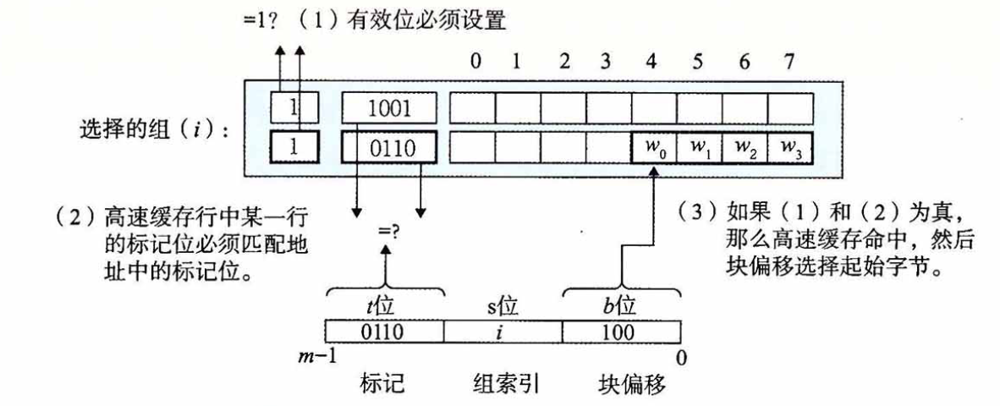

# 存储器层次优化

> 专注于梳理本章中出现的重要概念，对概念的描述尽量做到述而不作，避免因为个人理解偏差对其他人造成误导。
>
> 本章主要介绍为CPU存放指令和数据的存储器系统，以及其对应的层次结构，一定程度上能帮助我们理解，如何通过数据访问局部性，来提高程序性能。

* 存储器系统（memory system）

  具有不同容量，成本和访问时间的存储设备的层级结构。CPU寄存器保存最常用的数据，靠近CPU的小的、快速的高速缓存存储器（cache memory）作为一部分存储在相对慢速的主存储器（main memory）中数据和指令的缓冲区域。主存缓存存储在容量较大的、慢速磁盘上的数据，而这些磁盘又作为存储在通过网络连接的其他机器的磁盘或磁带上的数据的缓冲区域。

* 访问局部性（locality）

  具有良好局部性的程序倾向于一次又一次地访问相同的数据项集合，或是倾向于访问邻近的数据项集合。具有良好局部性的程序比局部性差的程序更多地倾向于从存储器层次结构中较高层次处访问数据项，因此运行的更快。

## 存储技术

* 随机访问存储器

  分为静态RAM和动态RAM，SRAM比DRAM更快，一般作为高速缓存存储器，DRAM一般用于做主存或帧缓冲区，在一个系统中，DRAM能存储的字节数比SRAM多。

  * 静态RAM

    每个位存储在一个双稳态的存储器单元中，每个单元是用一个六晶体管电路来实现的，该电路可以无限期地保持在两个不同的电压配置或状态之一，其他的任何状态都是不稳定的。

    正是由于它的双稳态特性，只要有电，它就会永远的保持它的值，即使有干扰存在。但是每个单元需要六个晶体管，相对代价比较高。

  * 动态RAM

    每个位存储为对一个电容的充电，每个单元由一个非常小的电容和一个访问晶体管组成。但其对干扰非常敏感，而且很多原因会导致漏电，使得DRAM单元在10~100毫秒的时间内失去电荷，所以内存周期必须周期性地通过读出，然后重写来刷新内存每一位。有些系统使用纠错码，计算机的字会被多编码几个位，使得电路可以发现并纠正一个字中任何单个的错误位。

* 传统的DRAM

  DRAM芯片被分成d个超单元，每个超单元都由$w$个DRAM单元组成，一个$d\times w$的DRAM总共存储$dw$位信息。超单元被组织成一个r行c列的长方形阵列。即$rc=d$。用行列的下标来标记每个超单元。如下图所示，是一个128位$16\times 8$的DRAM芯片的组织。信息通过引脚的外部连接器流入和流出芯片，每个引脚携带一个1位的信号，图中所示的8个data引脚，能传送一个字节到芯片或从芯片传出一个字节，以及2个addr引脚，携带2位的行和列超单元地址。

  

  每个DRAM芯片被连接到某个称为内存控制器（memory controller）的电路，内存控制器将行地址发送给DRAM，DRAM将一整行的内容都复制到一个内部缓冲区，内存控制器进而发送列地址，DRAM从行缓冲区读或写对应超单元的$w$位。

  DRAM被组织成二维阵列，可以降低芯片上的地址引脚数量，但必须分两步发送地址，这增加了访问时间。

* 内存模块（memory module）

  DRAM芯片封装在内存模块中，如图所示是用8个64Mbit（$8M\times 8$）的DRAM芯片，总共存储$64MB$，每一个超单元存储主存的一个字节，相应超单元地址的8个超单元表示主存中字节地址A处的64位字。

  

  通过将多个内存模块连接到内存控制器，能够聚合成主存。在这种情况下，当控制器收到一个地址A时，控制器选择包含A的模块k，将A转换为$(i, j)$格式，并将$(i,j)$发送到模块k。

* 增强的DRAM

  基于传统的DRAM单元，进行一些优化，提高访问基本DRAM单元的速度。

  * 快页模式DRAM（FPM DRAM）

    允许对同一行连续地访问可以直接从行缓冲区得到服务。

  * 扩展数据输出DRAM（EDO DRAM）

    FPM DRAM的增强形式，允许各个CAS信号在时间上靠得更紧密一点。

  * 同步DRAM（SDRAM）

  * 双倍数据速录同步DRAM（DDR SDRAM）

  * 视频RAM（VRAM）

* 非易失性存储器

  DRAM和SRAM在断电后会丢失它们的信息，相对的有非易失性存储器，ROM以它们能够被重编程（写）的次数和对它们进行重编程所用的机制来区分的。

  * 可编程ROM（Programmable Rom, PROM）

    只能被编程一次，PROM的每个存储单元有一种熔丝，只能用高电流熔断一次。

  * 可擦写可编程ROM（Erasable Programmable ROM, EPROM）

    透明石英窗口，允许光到达存储单元，紫外线光照射过窗口，EPROM单元就被清除为0，对EPROM编程是通过使用一种把1写入EPROM的特殊设备来完成的。其能够被擦除和重编程的次数的数量级可以达到1000次。

  * 电子可擦除PROM（EEPROM）

    不需要一个物理上独立的编程设备，因此可以直接在印刷电路卡上编程。其能够被擦除和重编程的次数第数量级可以达到$10^5$次。

  * 闪存（flash memory）

    基于EEPROM，如固态硬盘（SSD）。

  当一个计算机系统通电以后，它会运行存储在ROM中固件（程序），固件提供了少量基本的输入输出函数。

* 访问主存

  数据流通过总线（bus）的共享电子电路在处理器和DRAM主存之间进行传输。将CPU和主存之间的数据传输步骤称为事务，分为读事务和写事务。

  总线是一组并行的导线，能携带地址、数据和控制信号。具体怎么传输，取决于总线的设计。控制线上携带的信号会同步事务，并标识出当前正在被执行的事务的类型。

  如下图所示的计算机系统，由CPU芯片、I/O桥接器的芯片组、组成主存的DRAM内存模块。这些部件由一对总线连接起来，系统总线（连接CPU和I/O桥接器）和内存总线（连接I/O桥接器和主存），I/O桥接器将系统总线的电子信号翻译成内存总线的电子信号。

  

  如下图所示，是指令`movq A, %rax`（将地址A的内容加载到寄存器中）的执行过程。

  CPU芯片上的总线接口电路，发起读事务，首先，CPU将地址A放到系统总线上，I/O桥将信号传递到内存总线，然后主存根据内存总线上的地址信号，从DRAM中取出数据字，并将数据写到内存总线。I/O桥将内存总线信号翻译成系统总线信号，然后沿着系统总线传递，最后CPU感觉到系统总线上的数据，从总线上读数据，并将数据复制到指定寄存器。

  

* 磁盘的构造

  磁盘由盘片组成，每个盘片由两个表面覆盖磁性记录材料的表面组成。盘片中央的可旋转的主轴，使得盘片以固定的旋转速率旋转。

  如图所示，盘片的表面由一组称为磁道的同心圆组成，每个磁道被划分成一组扇区，每个扇区包含相等数量的数据位，扇区之间通过间隙分隔开。

  柱面是所有盘片表面上到主轴中心的距离相等的磁道的集合。

  

* 磁盘的容量

  一个磁盘上可以记录的最大位数，由记录密度、磁道密度和面密度决定。其中

  * 记录密度为，磁道一英寸的段中可以放入的位数
  * 磁道密度为，从盘片中心出发半径上一英寸的段内可以有的磁道数
  * 面密度为，记录密度与磁道密度的乘积

  由于扇区的数目由最靠内的磁道能记录的扇区数决定，为了保持每个磁道有固定的扇区数，越往外的磁道扇区隔得越开，为了提高面密度，同时避免扇区间隙变得很大，使用”多区记录“的技术，柱面集合被分为不相交的子集合，称为记录区，每个区包含一组连续的柱面，一个区中的每个柱面中的每条磁道都有相同数量的扇区，该扇区数由该区中最里面的磁道所能包含的扇区数决定。
  $$
  磁盘容量 = 每扇区的字节数\times 每磁道的平均扇区数\times 每个表面的磁道数 \\
  \times 每个盘面的表面数\times 每个磁盘的盘片数
  $$
  
* 磁盘操作

  磁盘用读/写头来读写存储在磁性表面的位，读/写头连接到一个转动臂的一端，通过沿着半径轴前后移动这个转动臂，驱动器可以将读/写头定位在盘面的任何磁道上，该机械过程称为寻道。如图所示，读/写头在盘面上高速滑动，如果盘面上有灰尘，会停下来撞到盘面，所谓的读/写冲撞，故磁盘总是密封保存。虽然每个盘面都有一个独立的读/写头，但是所有读/写头垂直排列，一致行动，在任何时刻，所有读/写头都位于同一个柱面上。

  

  磁盘以扇区大小的块来读写数据，对扇区的访问时间由寻道时间、旋转时间和传送时间组成。

  * 寻道时间

    传动臂首先将读/写头定位到包含目标扇区的磁道上，移动传动臂的时间为寻道时间。

  * 旋转时间

    当读/写头定位到指定的磁道下时，驱动器等待目标扇区的第一个位旋转到读/写头下，其性能依赖于读/写头到达目标扇区时盘面的位置以及磁盘的旋转速度。最大旋转延迟为$\frac{1}{旋转速率}\times \frac{60s}{1min}$

  * 传送时间

    一个扇区的旋转时间依赖于旋转速度和每条磁道的扇区数目，一个扇区以秒为单位的平均传送时间为，$\frac{1}{旋转速率}\times \frac{60s}{1min}\times\frac{1}{每磁道的平均扇区数}$。

  访问扇区中的第一个字节需要用很长时间，访问剩下字节几乎不用时间。寻道时间和旋转延迟大致相等，故可以直接将寻道时间乘2来估计磁盘访问时间。

* 逻辑磁盘块

  为了对操作系统隐藏磁盘的复杂性构造，将磁盘视为一个B个扇区大小的逻辑块序列，磁盘控制器维护着逻辑块号和实际（物理）磁盘扇区之间的映射关系，将输入的逻辑块号翻译成（盘面，磁道，扇区）的三元组。

  格式化磁盘容量小于磁盘的最大容量。

* 连接I/O设备

  诸如键盘、磁盘、图形卡等输入/输出设备，都是通过I/O总线连接到CPU和主存的，I/O总线的设计和底层CPU无关（区别于系统总线和内存总线），虽然传输速度慢，但是支持各种第三方输入/输出设备。

  * 通用串行总线（USB）
  * 图形卡负责代表CPU在显示器上画像素
  * 主机总线适配器将一个或多个磁盘连接到I/O总线。
  * 其他的设备，通过扩展槽直接与总线的电路连接。

  

* 访问磁盘

  CPU使用”内存映射I/O“的技术来向I/O设备发射命令。地址空间中有一块地址是为与I/O设备通信保留的，每一个这样的地址称为一个I/O端口。

  假设磁盘控制器映射到端口0xa0，CPU可能通过执行三个对地址0xa0的存储指令，发起磁盘读（指明发起读指令，指明读的逻辑块，指明存储磁盘扇区内容的主存地址）。磁盘执行读操作并将内容直接传送给主存，这种不需要CPU干涉的过程称为直接内存访问（DMA）。磁盘控制器将中断信号发送到CPU芯片的一个外部引脚上，CPU暂停当前的工作，跳转到一个操作系统例程。

  

* 固态硬盘

  是一种基于闪存的存储技术，其被封装插到I/O总线上标准硬盘插槽中，处理来自CPU的读写逻辑磁盘块的请求，一个SSD封装由一个或多个闪存芯片和闪存翻译层组成，其中闪存翻译层和磁盘控制器类似，将对逻辑块的请求翻译成对底层物理设备的访问。如图所示，一个闪存由B个块的序列组成，每个块由P页组成，数据以页为单位读写，只有在一页所属的块整个被擦除之后，才能写这个页，这导致了随机写相对比较慢，因为如果一个写操作试图修改一个包含已经有数据的页p，那么这个块中所有带有用数据的页都必须先被复制到一个新的（擦除过）的块中，然后才能对页p进行写操作。

  SSD由半导体存储器构成，没有移动的部件，因而随机访问时间比旋转磁盘（机械硬盘）要快，能耗更低。

* 存储技术趋势

  * 不同存储技术有不同的价格和性能折中。
  * 不同存储技术的价格和性能属性以截然不同的速率变化着。
  * DRAM和磁盘的性能滞后于CPU的性能，且差距不断加大。
  * 现代计算机频繁使用基于SRAM的高速缓存，试图弥补处理器-内存之间的差距。

## 局部性

* 局部性原理

  * 时间局部性（temporal locality）

    被引用过一次的内存位置，很可能在不远的将来再多次被引用。

  * 空间局部性（spatial locality）

    一个内存位置被引用了一次，那么程序很可能咋不远的将来引用附近的一个内存位置。

* 对程序数据引用的局部性

  对连续数据的访问来说，步长为k的引用模式的空间局部性会随着步长的增加而下降。

  重复引用相同变量的程序有良好的时间局部性。

* 取指令的局部性

  程序指令和数据一样，是放在内存中的，比如一个循环中的指令是按照连续的内存顺序执行的，因此循环有良好的空间局部性，而且因为循环体会被执行多次，故它也有很好的时间局部性。

  循环体越小，迭代次数越多，局部性越好。

## 存储器层次结构

* 存储器层次结构

  将硬件和软件的基本属性互相补充，从高层往底层走，存储设备变得更慢、更便宜、更大，如图所示。

  其设计的中心思想是：对于每个k，位于k层的更快更小的存储设备作为位于k+1层的更大更慢的存储设备的缓存，即层次结构中的每一层都缓存来自较低一层的数据对象。

  

* 高速缓存

  一个小而快速的存储设备，作为存储在更大、更慢的设备中的数据对象的缓冲区。

* 存储器层次结构中缓存的一般性概念

  第k+1层的存储器被划分成连续的数据对象组块，称为块，每个块都有唯一的地址和名字，如图所示，数据总是以块大小作为传送单元，在第k层和第k+1层之间来回复制，虽然层次结构中任何一对相邻的层次之间块大小是固定的，但是其他层次对之间可以有不同的块大小。一般来说，为了补偿层次结构较低层的设备的访问时间较长，倾向于使用较大的块。

  

  所以这里的分块，应该是一个逻辑概念，视不同的传输层而定。

  缓存命中，指当程序需要第k+1层的某个数据对象d时，它首先在当前存储在第k层的一个块中查找d，如果d刚好缓存在第k层中，即缓存命中。

  如果发生了缓存不命中，则需要由缓存的替换策略决定，选择哪一个块作为牺牲块。同时也需要放置策略决定，即把新的块放在缓存的哪个位置，随机放置指，允许来自第k+1层的任何块放在第k层的任何块中，但这样不好定位。而遵循严格的放置策略，某个块只能限制放在第k层块的一个小的子集中，可能会引起冲突不命中。

  在每一层上，都需要某种形式的逻辑必须管理缓存，将缓存划分成块，并在不同层之间传送块，判断是否命中，并处理它们。

## 高速缓存处理器

* 通用的高速缓存存储器组织结构

  假设存储器的地址有m位，形成$M=2^m$个不同的地址，将该高速缓存组织成一个有$S=2^s$个高速缓存组的数组，每个组包含E个高速缓存行，每行由一个$B=2^b$字节的数据块组成，一个有效位指明该行是否包含有意义的信息，还有$t=m-(b+s)$个标记位，唯一的标识存储在这个高速缓存行中的块，如图所示。

  一般来说，高速缓存的结构可以用元组$(S, E, B, m)$来描述，当一条加载指令指示CPU从主存地址A中读一个字的时候，它将地址A发送到高速缓存，高速缓存需要判断自己是否包括地址A所指的数据块，其查找过程如下：

  参数S和B将m个地址分为了三段，其中s个组索引位是一个到S个组的数组索引，A中的t个标记告诉这个组中的哪一行包含这个字，当且仅当设置了有效位并且该行的标记位与地址A中的标记位相匹配时，组中的这一行才包含这个字。确定了组和行以后，b个块偏移位给出了在B个字节的数据块中的字偏移。

  

* 直接映射高速缓存

  根据每个组的高速缓存行数E，将高速缓存分为不同的类，每个组只有一行（E=1）的高速缓存称为直接映射高速缓存。

* 访问直接映射高速缓存的例子

  假设一个系统，有一个CPU，一个寄存器文件，一个L1高速缓存和一个主存，当CPU执行一条读内存字w的指令，它向L1高速缓存请求这个字。

  * 组选择

    高速缓存从w的地址中间抽取出s个组索引位，并选择对应的组。

    

  * 行匹配

    确定是否有字w的一个副本存储在组i包含的高速缓存行里，直接高速缓存的每个组只包含一行，当且仅当设置了有效位，而且高速缓存行中的标记与w的地址中的标记相匹配的时候，这一行包含w的一个副本。

  * 字选择

    一旦命中，就知道w就在这个块中的某个地方，确定所需要的字在块中是从哪开始的。块偏移位提供了所需要的字的第一个字节的偏移。

    

  * 不命中时的行替换

    如果缓存不命中，那就需要从存储器层次结构中的下一层取出被请求的块，然后将新的块存储在组索引位指示的组中的一个高速缓存行里。在一般情况下，如果组中都是有效高速缓存行，那么必须要驱逐出一个现存行。对直接映射高速缓存，由于每个组只包含一行，其替换策略非常简单。

  * 冲突不命中

    当程序访问大小为2的幂的数组时，直接映射高速缓存中通常会发生冲突不命中，即高速缓存反复地加载和驱逐相同的高速缓存块的组。造成了“抖动”现象，一个比较简单的做法是，在每个数组的结尾放B字节的填充，来改变数组元素到组的映射。

* 组相联高速缓存

  改进直接映射高速缓存容易造成的“冲突不命中”的问题，组相联高速缓存中每个组都保存有多于一个的高速缓存行，即$1 \lt E \lt C/B$的高速缓存通常称为E路组联高速缓存。

* 访问组相联高速缓存的例子

  * 组选择

    这个的组选择与直接映射高速缓存的组选择一样，组索引位标识组。

    

  * 行匹配和字选择

    由于组中任意一行都可以包含任何映射到这个组的内存块，所以高速缓存必须搜索组中的每一行，寻找一个有效的行，其标记与地址中的标记相匹配。若找到对应的行，即命中，块偏移从这个块中选择一个字。

    

  * 不命中时的行替换

    如果CPU请求的字不在组的任何一行中，那么缓存就不命中，高速缓存必须从内存中取出包含这个字的块，一旦高速缓存取出了对应的块，在高速缓存非空的时候，就需要有一个好的替换策略，决定选择哪一个非空行作为替换目标，如LFU，LRU等。

* 全相联高速缓存

  是由一个包含所有高速缓存行的组，即$E=C/B$组成，只有唯一的组，该唯一的组包含了所有高速缓存行。

* 访问全相联高速缓存的例子

  * 组选择

    因为只有一个组，其地址中没有组索引位，地址只被划分成一个标记和一个块偏移。

    

  * 行匹配和字选择

    全相联高速缓存中的行匹配和字选择与组相联高速缓存中一致，它们之间的区别主要是规模大小的问题。

    高速缓存电路必须并行地搜索许多相匹配的标记，构造一个又大又快的相联高速缓存很困难，且代价比较高，故全相联高速缓存只适合做小的高速缓存。

    

